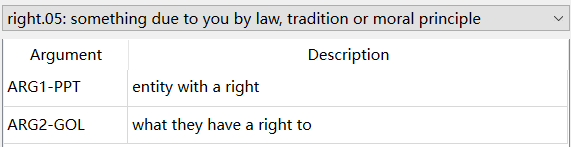
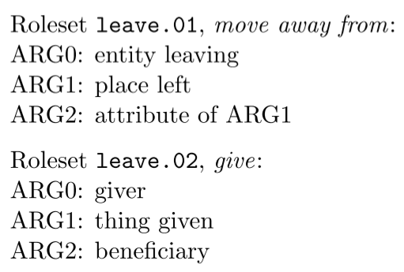
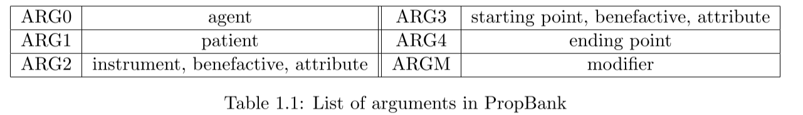

# 标注逻辑

- ⽬标：为句⼦中的成分标注其语义角⾊；
- ⽅法：以**谓词 Predicate** 为中⼼，根据谓词的语境义选择对应的**角⾊集 Roleset**，再查阅角⾊集对句⼦中的语义成分进⾏参数 Argument 标注。

## 谓词 Predicate

描述客体性质、特征或者客体之间关系的词项，可以理解为“主题词”或“关系词”；不⼀定为谓语动词，也可以名词、动名词形容词或词组的形态出现。

例如，right 作为名词的角色集如下所示：

## 角色集 Roleset

⼀个谓词可能对应多个语义，⼀个语义可以限定⼀组语义角⾊（编号参数）集合，我们称之为“角⾊集”。每个谓词⾄少拥有⼀个角⾊集，标注者需要进⾏角⾊集选择。

例如，leave 的两个角⾊集如下所示：

## 参数 Argument

语义角⾊的分类标签，包括编号参数（Numbered Arguments）和修饰参数（ARG-M）。

### 编号参数 Numbered Arguments（ARG0, ARG1, ..., ARGA）

反映需要与谓词搭配的特定元素，或通常与谓词⼀起出现的成分，例如⼀个动作的发出者、接收者和受益者，动作的起始点、终⽌点等。通常⽽⾔，ARG0是原型动因（Prototypical Agent），ARG1 是原型受动者（Prototypical Patient）或者主题（Theme）。角⾊集就是编号参数的集合，可以理解为谓词某⼀⽤法下的语义主⼲单元。

通常每个角色集都针对其应用场景定义了所有相关的编号参数，但在极少数情况下，一个谓词在句中可能对应超过一个原型动因，但相关义项的角色集只定义了其中一个。此时，可以用 ARGA 表示剩余的所有原型动因。

### 修饰参数 Modifier（ARGM-*）

编号参数组成主⼲语义，⽽修饰参数对谓词进⾏功能性修饰。⼀般是不同功能的定语
或状语修饰语，如下表所⽰。

| 标签 | 注释                           |
| ---- | ------------------------------ |
| ADJ  | 通⽤形容词 Adjective           |
| ADV  | 通⽤副词 Adverb                |
| CAU  | 起因 Cause                     |
| COM  | 共格者 Comitative              |
| CXN  | 形容词结构 Construction        |
| DIR  | ⽅向 Directional               |
| DIS  | 连接词 Discourse               |
| EXT  | 范围 Extent                    |
| GOL  | ⽬标 Goal                      |
| LOC  | 地点 Locative                  |
| LVB  | 轻动词 Light verb              |
| MNR  | ⽅式 Manner                    |
| MOD  | 情态动词 Modal                 |
| NEG  | 否定词 Negation                |
| PRD  | 第⼆谓语 Secondary Predication |
| PRP  | 动机 Purpose                   |
| REC  | 反⾝词 Reciprocal              |
| TMP  | 时间 Temporal                  |

*注：类别标签的详细说明与⽤例请查阅[修饰参数⽤例](modifier.md)。*
