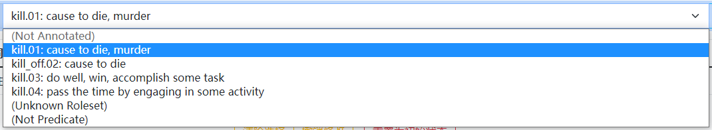

# 标注流程

⼈⼯参数标注任务包括谓词选择、角⾊集选择和参数标注三阶段。其中，参数标注必须与选择的角⾊集相对应。标注者需注册登陆标注⽹⻚ ⽅可进⾏标注。下⾯对三个标注阶段进⾏详细说明。

## 谓词选择

正常情况下，谓词为单词，由后端⾃动识别，并⾃动标注为 REL（Relation）标签。少数情况下，谓词为词组（介词短语/复合单词拆分），标注者需要在⾃动识别结果的基础上，参考角⾊集选项，对谓词词组进⾏补充标注。

例如，kill 的第⼆个角⾊集为 kill_off，标注者需要将句中的 kill 和 off 两个单词合并标注为谓词。

### 识别错误的谓词

若⾃动识别的谓词满⾜下述任⼀条件，则认为识别错误，仅将角⾊集选为 Not Predicate，⽆需进⾏后续标注：

- 谓词是定语形容词或副词；
- 谓词是不含动作性的名词，不指代任何事件或状态，如“He has drawn a picture.”中的 picture；
- 谓词是某个介词或连词结构的⼀部分，如 according to 中的 according；
- 句中不存在与该谓词的任意角⾊集所匹配的参数，如“The death penalty prevents crimes.”中的 crimes；
- 其他标注者判定为⾮谓词的情形。

## 角色集选择

⼀般情况下，结合谓词在句⼦中的结构与含义选择相应的角⾊集即可。如果谓词难以确定角色集，则它有可能是轻动词，或者角色集数据库没有收录这一角色集，请按照对应的情况处理。

### 轻动词

若谓词是动词且符合下列描述，则认为该谓词是轻动词，角⾊集选择轻动词（“.LV”），⽆需进⾏后续标注：

- 谓词与⼀个指代事件（eventive）或状态（stative）的名词绑定成为短语，⽽谓词不承担主要实义，如 take a bath 中的 take；
- 【谓词 + 名词】的短语可以被【仅与名词词义相关的动词】所取代，如 make a mistake 与 mistaken；
- 谓词的主语和名词存在主从关系，⽽谓词在其间起到联系作⽤，如“I made/got a call.”中 I 分别是 call 的主语和宾语。

### 角色集缺失

若不存在符合句意的角⾊集，请选择角⾊集 Unknown Roleset，并将谓词的动因（agent）标注为 ARG-0, 受动者（patient）标注为 ARG-1，同时标注与谓词有关的修饰参数。

*注：如果该谓词是轻动词用法，但没有相应的 .LV 角⾊集，优先查找其他角⾊集是否有匹配的⽤法，如果没有，再选择 Unknown Roleset。*

## 参数标注

参考角⾊集及相应例句，优先标注编号参数（ARG-0,1,2,...），其次标注修饰参数（ARG-M）。部分特殊句式的处理方式如下：

### 关系从句

- 谓词在主句中，先⾏词有参数意义，则将先⾏词与定语从句合并标注为⼀个参数；
- 谓词在从句中，关系词有参数意义，则将先⾏词标注为参数，关系词标注为该参数的引⽤。

### 语义结构整体标注

- 介宾结构和 to do 不定式作为整体进⾏标注；
- 冠词和随后的名词作为整体进⾏标注。

### 单引号缩写

默认以单引号为界拆分缩写结构为两个单词，需分辨如下情景进⾏标注：

- 否定缩写，如 shouldn't 中的 should 和 n't，分别标注；
- 所有格缩写，如 people's 中的 people 和 's，同时选中、合并标注。

### 形式主语

作为形式主语的 it（如在“It is clear that I'm unclear.”中）⽆须标注。
