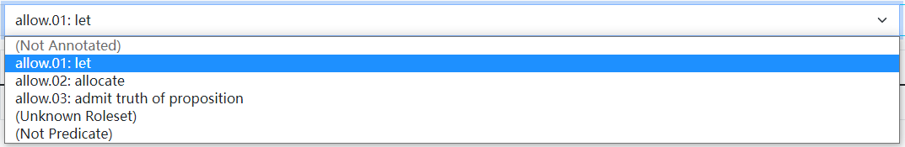

# 标注网站

标注网站的网址为 <http://120.79.65.124:5000>，请使用分配的帐号和密码登录并完成标注任务。

## 帐号登录

点击网页主页上的“登录”按钮，而后输入用户名和密码登录标注网站。

页面将展示您的账号所分配到的任务组，点击选择一组即可进入标注页面。

## 标注界面

选择某个任务组后，即进入该任务组对应的标注界面，从第一个任务开始，如下图所示。

各个组件的意义与功能如下图所示：

完成当前任务标注后的标注界面如下图所示，注意角色集和参数均已标注完毕。

## 操作流程

*注意：标注过程中请务必保持网络连接畅通，否则当前任务的未保存修改可能会丢失；如果网页显示不正常，请检查并尝试关闭 VPN。*

### 角色集标注

确认谓词无误后，通过右侧下拉栏选择合适的角色组；请务必选择合适的角色集或 Unknown Roleset、Not Predicate 两个特殊选项，不要保留默认的 Not Annotated 选项。

点击“角色集说明”可查看选定的角色集详情和例句，该界面仅在选择了角色集时生效。

### 参数标注

单击单词或长按鼠标左键拖拽，选中目标标注范围（也可以清除已选择的范围），随后点击对应的参数标签完成标注；点击“清空选择范围”可重置选择范围，重新选择。

#### 参数引用

进行引用参数的标注时，请首先为先行词、然后为关系词标注相同的标签，系统会自动将后者（如下图绿色选中部分）识别为引用参数，以 R- 前缀表示。

注意对于修饰参数而言没有引用的概念，因此同一个任务内允许存在若干同类修饰参数，它们会始终按顺序编号。

#### 删除标注

点击“撤销未保存修改”，可以还原上次保存结果；点击“重置为初始状态”，可以删除除“REL”以外的所有标签，并重置角色集选项为 Not Annotated。

### 任务保存与切换

当前谓词标注完成后，单击“上一个”或“下一个”切换任务，切换时将自动保存标注结果。点击“保存当前任务”，可做即时保存；点击“保存并切换任务组”可以保存任务并回到任务组选择界面。

### 错误反馈

点击“提交错误报告”，会弹出填写错误报告的界面。请选择合适的错误原因，并详细填写错误信息，点击“提交”即可提交错误反馈报告。

