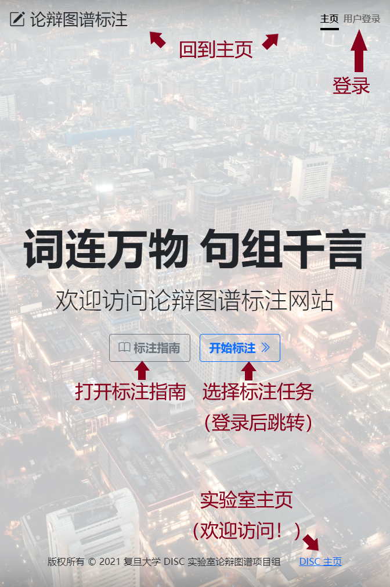
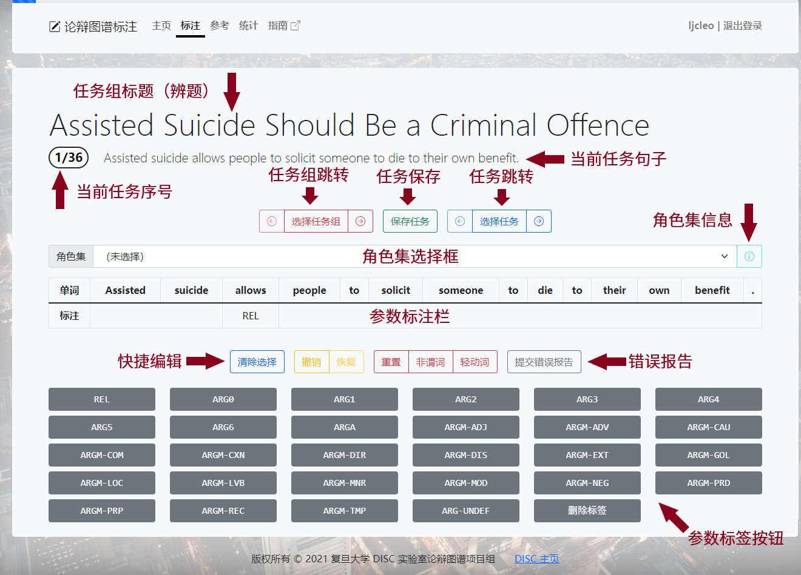
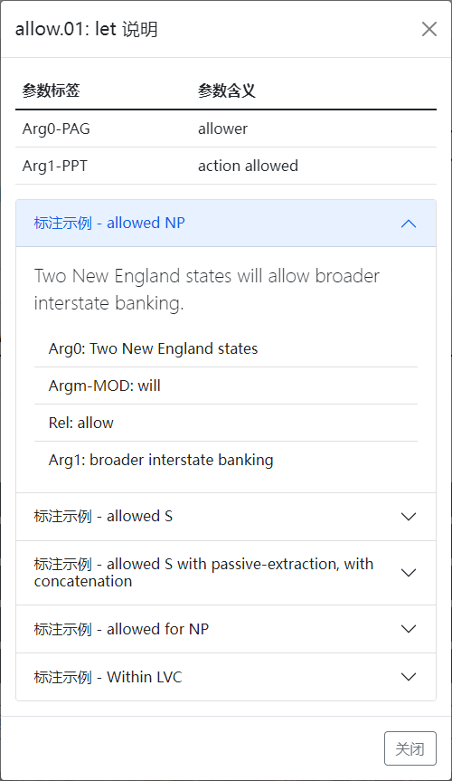
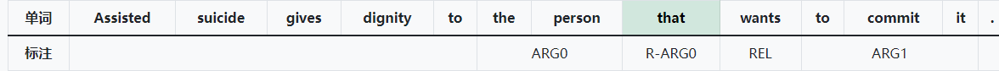
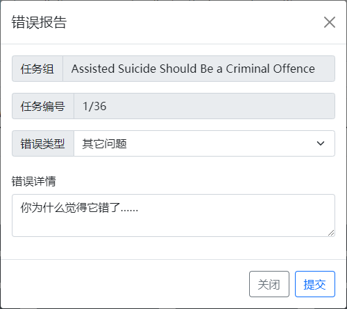

# 标注网站

标注网站的网址为 <http://120.79.65.124:5000>，请使用分配的帐号和密码登录并完成标注任务。

## 主页与登录

标注网站主页各部分功能如下图所示。用户未登录时主页显示界面如左图，可以点击导航栏上的“登录”按钮进入登录页面，输入用户名和密码登录标注网站。登录后主页变为右图，用户可以点击“开始标注”按钮或导航栏上的“标注”按钮，开始标注任务，并且可以随时退出登录并清除浏览器缓存。点击“标注指南”会打开一个新标签并跳转到本指南的首页。

## 任务组与标注界面

点击“开始标注”后，网页将展示您的账号所分配到的任务组，如下图所示。点击选择一个任务组，即可进入对应任务组的标注页面，并自动跳转至上次离开该任务组时正在标注的任务（新用户或网站更新后第一次访问会跳转至第一个任务）。点击导航栏上的“指南”按钮同样可以在新标签打开本指南。

标注界面各个组件的意义与功能如下图所示：

完成当前任务标注后的标注界面如下图所示，注意角色集和参数均已标注完毕。

## 操作流程

*注意：标注过程中请务必保持网络连接畅通，否则当前任务的未保存修改可能会丢失；如果网页显示不正常，请检查并尝试关闭 VPN。*

### 角色集标注

确认谓词无误后，可以通过角色集下拉框选择合适的角色集，如下图所示。请务必选择合适的角色集或特殊标签，不要保留默认选项。

选择任一角色集后，点击右侧的角色集说明按钮，可查看选定的角色集详情，包括参数标签和标注示例，如下图所示。所有的角色集详情来自于 [PropBank 角色集数据库](https://verbs.colorado.edu/propbank/framesets-english-aliases)，如果对谓词角色集仍有疑惑，可以访问数据库网站，查看更详细的注释。

由于原版 PropBank 是基于语法树标注的，因此部分例句会出现不属于原句子的语法标签（如用于指示隐藏主语的 trace 结构）。无论如何，请以网页展示的角色集意义与相关参数为标准选择角色集，以本指南列出的规则为标准标注参数。

### 参数标注

在参数标注栏上单击单词或长按鼠标左键拖拽，可以选中标注范围（也可以清除已选择的范围），随后点击对应的参数标签完成标注，或点击“删除标签”按钮删除目标范围内涉及的所有参数标签。如果标注范围不连续，后续的连续段会以 C- 前缀表示。

#### 参数引用

进行引用参数的标注时，请首先为先行词、然后为关系词标注相同的标签，系统会自动将后者（如下图绿色选中部分）识别为引用参数，以 R- 前缀表示。删除某个编号参数时，会同步删除相关的引用参数；但删除引用参数时原编号参数会保留。

注意对于修饰参数而言没有引用的概念，因此同一个任务内允许标注若干同类修饰参数，它们会始终按顺序编号，删除时也只会删除对应的参数标注。

#### 快捷编辑

- 点击“清除选择”可重置选择范围，重新选择；
- 点击“撤销修改”，可以还原上次保存结果（注意每次离开本页面，网页都会自动保存任务，因此该功能仅限于撤销最近一次显示本页面或手动保存后的所有修改）；
- 点击“重置为初始状态”，可以删除除“REL”以外的所有标签，并重置角色集选项为 Not Annotated。

### 任务操作

页面下方的工具栏提供了任务跳转、保存，以及错误反馈等功能。当前任务标注完成后，可以按需执行下一步操作。

#### 任务跳转

左侧的工具栏可供任务跳转，其中单击左／右箭头可以切换至上／下一个任务；单击“选择任务”按钮会弹出任务列表，展示当前任务组下的所有任务，可以单击跳转至任意任务，。切换任务时，网页将自动保存当前任务的标注结果。

任务列表的每个条目显示了任务的句子、谓词和标注状态，如下图所示。其中，灰色表示任务尚未标注角色集，即任务尚未开始标注，如图中第七个任务开始的所有任务；黄色表示任务的角色集选项为 Unknown Roleset，即任务不能确定准确标注，如图中第四到第六个任务；绿色表示任务的角色集选项为某个谓词角色集或 Not Predicate，即任务已完成角色集标注（但不代表参数标注也已完成），如图中前三个任务。

如果标注过程中暂时无法确认某个任务的标注，可以临时选择 Unknown Roleset 作为角色集，从而在任务列表中突出显示该任务。无论如何，请尽量确保在任务截止时，任务组中所有任务均显示为绿色（除非确实有需要选择 Unknown Roleset 的任务）。

#### 任务保存

中间的工具栏可供任务保存，其中点击“保存当前任务”，可即时保存当前任务；点击“保存并返回”或导航栏上的“标注”按钮，可以保存任务并回到任务组选择界面。

#### 错误反馈

右侧的“提交错误报告”按钮可供填写并提交错误报告，点击会弹出相应界面，如下图所示。请选择合适的错误原因，并详细填写错误信息，点击“提交”即可提交错误反馈报告。

